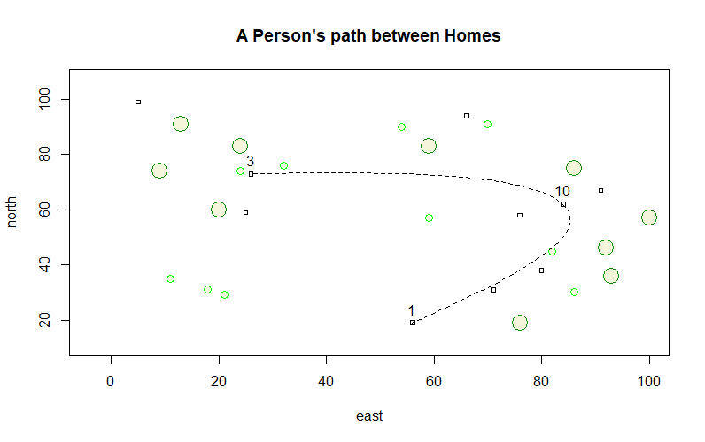

# Wicked Problems

## Plotting with R

The plot above shows the running path of a boy. Each plotted number indicates a dwelling within the plot of land. Green circles of varying size indicate trees within the area. 

