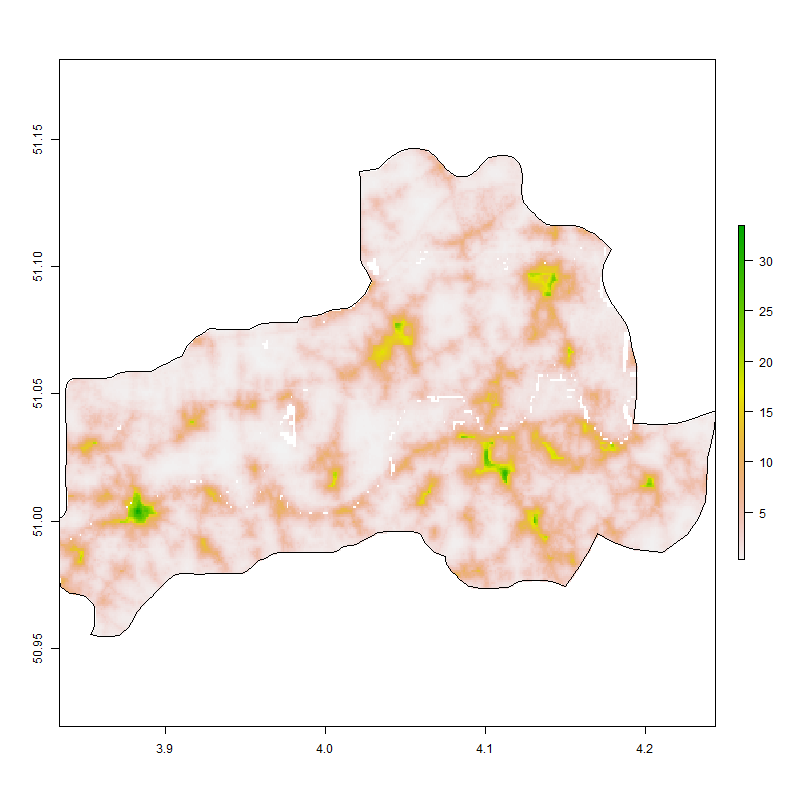
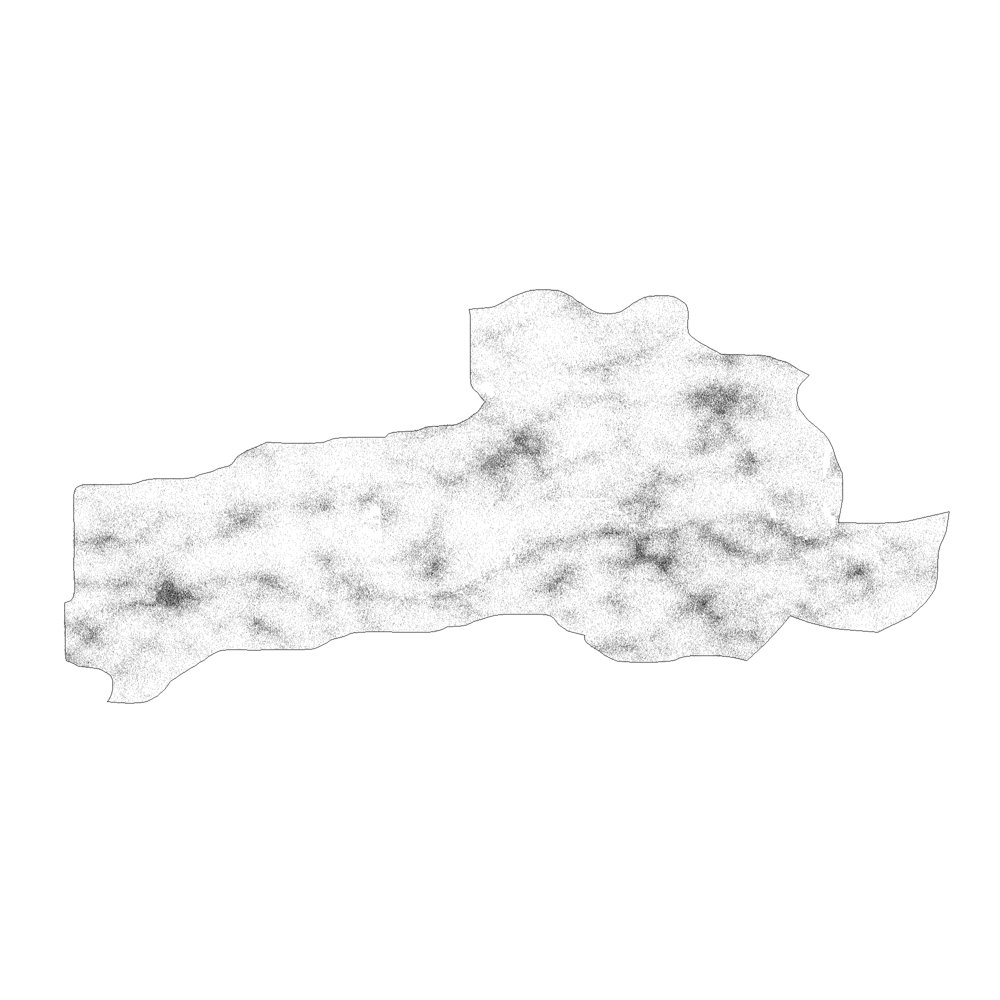
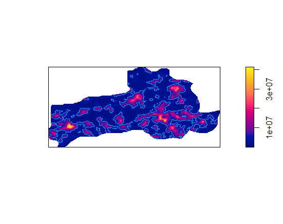
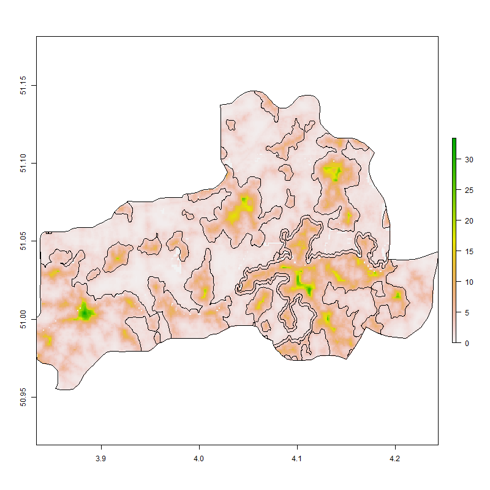
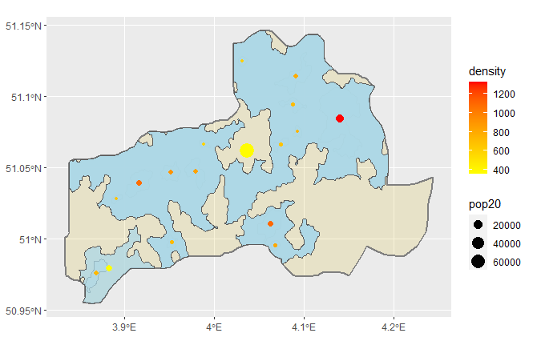

# Accessibility 1

   

After importing adm3 data for Belgium from GADM, I cropped and masked the raster to include data for solely Dendermonde, a subdivision of Oost-Vlaanderen with a population of approximately 200,000. The first plot shows a simple density plot of the region while the second plot uses the spatial probability distribution to create a point pattern of the region. 

After establishing the bandwidth, I created a density plot based on that value and added contour lines to show the boundaries of the more populated areas of Dendermonde. 

 

Based on the contour lines, I isolated the inside and outside polygons. I then brought the two sets of polygons together and filtered the largest polygon. On a simple density plot, the polygons outline the most urban areas of the region.

Using the urban area polygons, I identified the central points of each area and plotted points based on the overall population size and density of the area. 
