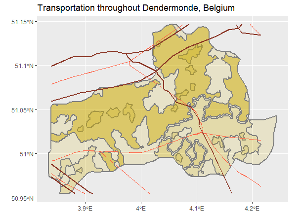
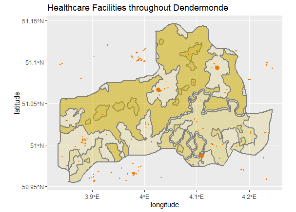
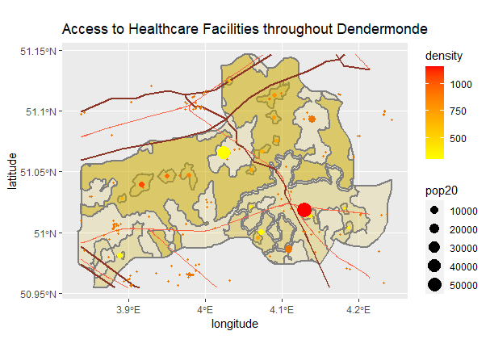

# Accessibility 2

 

Using the urban areas plot from before and data from HDX, I plotted the railways and roads of Dendermonde. The modes of transportation often show where more urban lie. I also plotted the healthcare facilities for Dendermonde's region. Hospitals and clinics are shown with larger points while doctors, dentists, and pharmacies are shown with smaller points. 

Finally, I plotted access to healthcare facilities, transportation, and central points of urban areas together on one plot to show the correlation between all three elements. Healthcare facilities often lie along modes of transportation which tend to bring urban populations together. 
