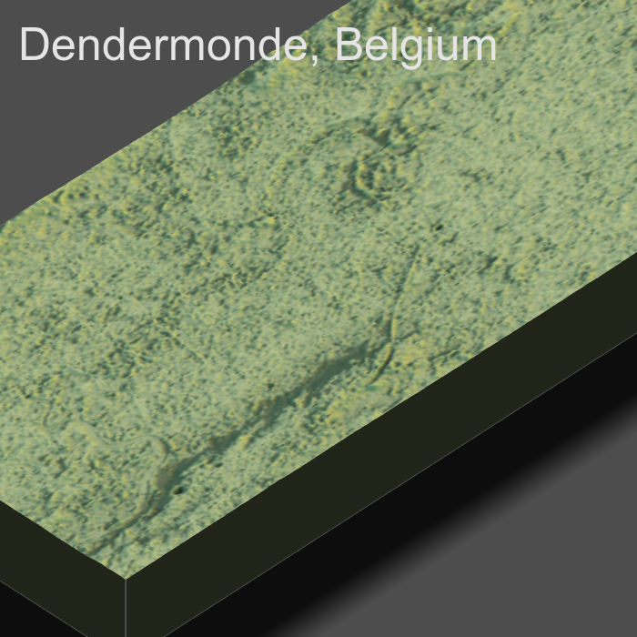
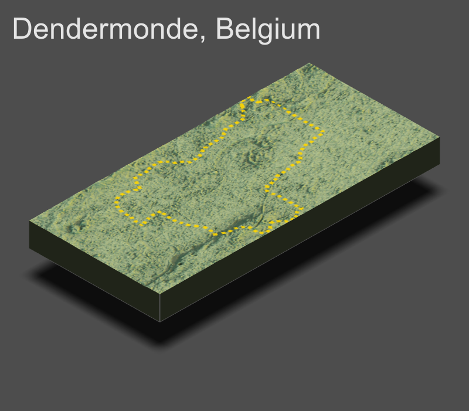

# Accessibility 3

After cropping the raster of Belgium to the region of Dendermonde, I converted the raster to a matrix so it could be plotted in 2 and 3 dimensions. The plot above shows a 2-dimensional representation of the bounding box of Dendermonde. 

I then created a 3-dimensional plot of the region while adding shadows, shade, and water if neccessary. 

Finally, I created a plot of an outline of the region, the polygons of the urban areas, roads, healthcare facilities, and a label for the largest city in the region. I plotted this overlay on top of the 3-dimensional plot to show an overarching image of the region.
