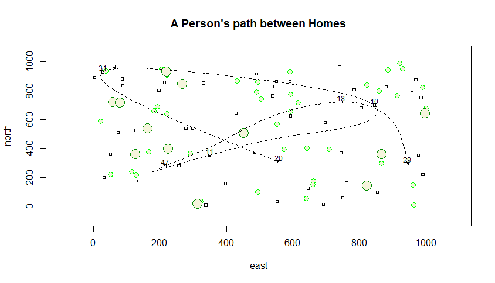

# Creating a More Complicated Plot

I first created a 100 x 100 plot, where the x-axis represented distance east and the y-axis represented that of north. Using the sample() function, 10 dwellings were randomly selected. These points were stored in a data frame and labeled. Randomly placed trees were also plotted. Using a spline, I connected 3 of the 10 dwellings to show a path between the points.

### Challenge Question

Using a similar set up to the previous exercise, I created a 1000 x 1000 plot with 50 randomly plotted dwellings. I also increased the amount of trees and the size of each plotted point to account for the increase in magnitude of data shown. 7 plots were randomly selected to create a longer, spline path. 
