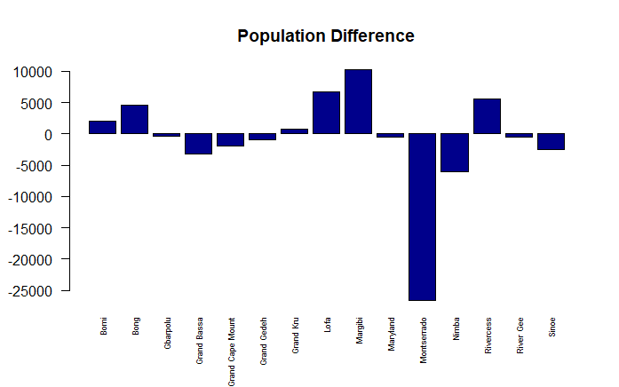
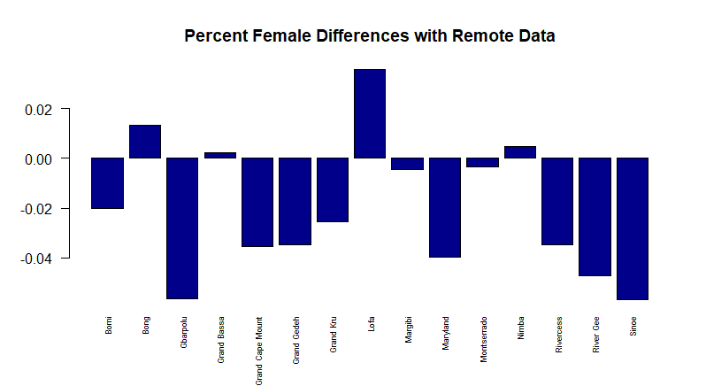

# Data Management Part 1

### Total Population of Each County

Using the source data, I created a bar plot that displayed the total population of each county in Liberia while distinguishing between male and female population.

### Difference in Total Population between Source and Remote Population Datasets

### Difference in percent Female between Source and Remote Population Datasets

### Population Density of Each Country

