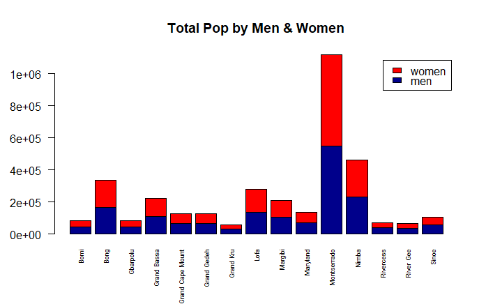
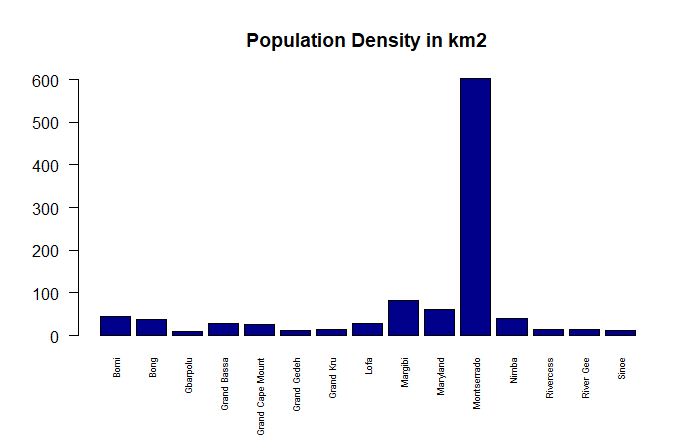

# Data Management Part 1

### Total Population of Each County

Using the source data, I created a bar plot that displayed the total population of each county in Liberia while distinguishing between male and female population.

### Difference in Total Population between Source and Remote Population Datasets

After finding the difference between the total population of each county, I created a bar plot displaying the differences in comparison to the source data.

### Difference in percent Female between Source and Remote Population Datasets

After finding the percent of the female population in each county for the source and remote data, I created a bar plot displaying the difference between the two data sets.

### Population Density of Each Country

Using the source data, I plotted the population density of each country in km2.
