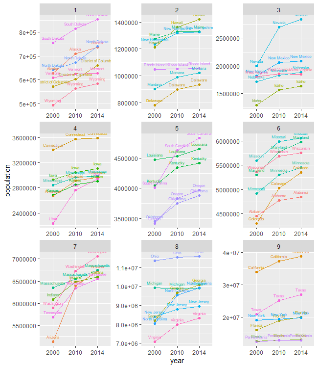
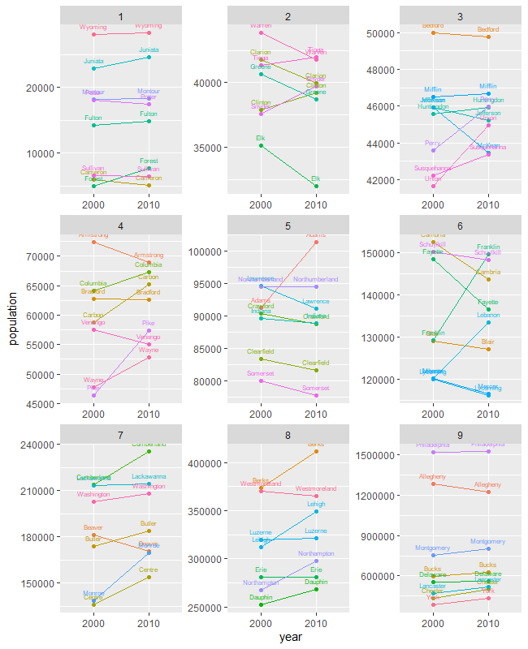

# Project 1

## Part 1

I collected data regarding institutions and their admissions of 2015 from the National Center for Education Statistics' Data Center website for this section. I narrowed my data analysis to four year colleges and colleges offering docorate degrees. The plots above show the total number of applications per state for a given region of the US. 

## Part 2

Using data from the Census API from 2000, 2010, and 2014, I created a plot that showed the changed in population for each state. The four plots are organized in quartiles to better display the data. 

## Stretch Goals

Using the same data from Part 2, I plotted the data in 9 quantiles rather than 4. I had to create a new quartile classification so the data was placed into 9 groups rather than 4. I then plotted the data in 3 columns. 

Using data from the 2000 and 2010 census, I collected and analyzed the data for US state counties. When subsetting the data, I selected counties with the state code 42, which was Pennsylvania. From there, I used a similar process as in Part 2 to analyze and plot the data in 9 quartiles.
