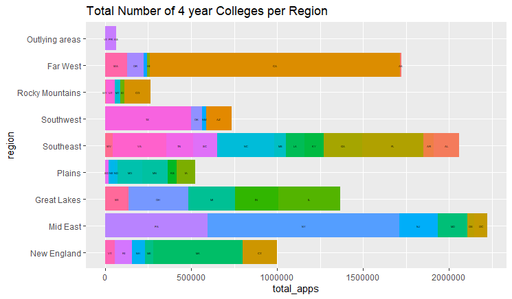
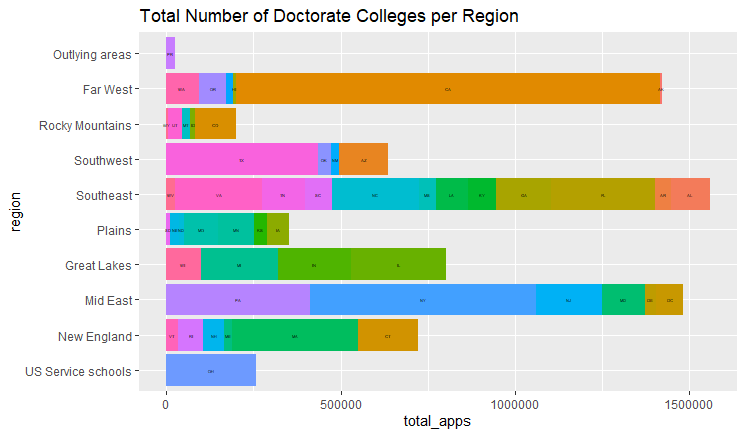

# Project 1

## Part 1

## Part 2

Using data from the Census API from 2000, 2010, and 2014, I created a plot that showed the changed in population for each state. The four plots are organized in quartiles to better display the data. 
