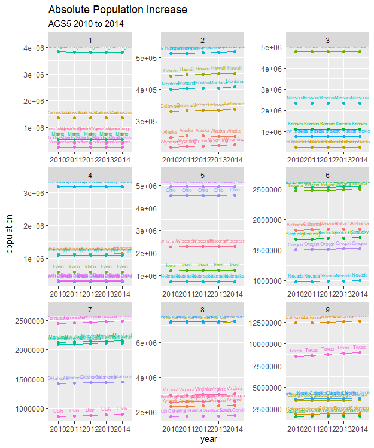
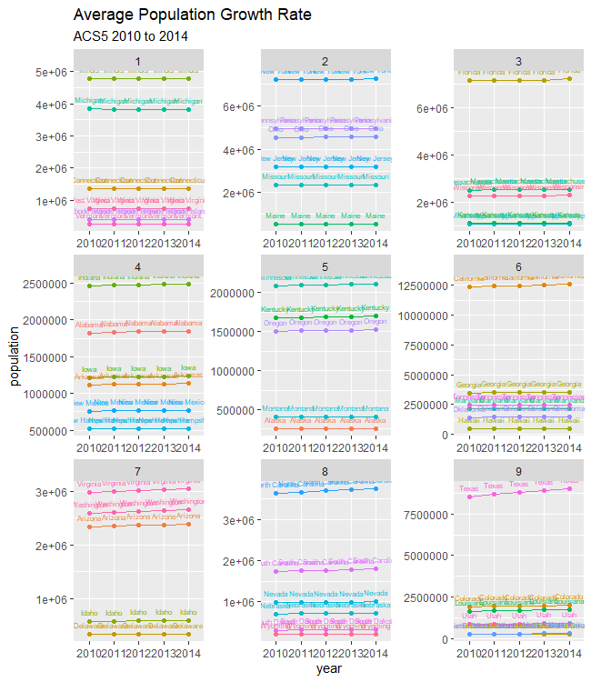

# Project 2

## Part 1

I collected data from the American Community Survey 5-Year Data API through the US Census Bureau. After binding the data from 2010-2014, I faceted the total population growth
and the annual growth rate into 9 quantiles. The plots above show the facets for each variable.
