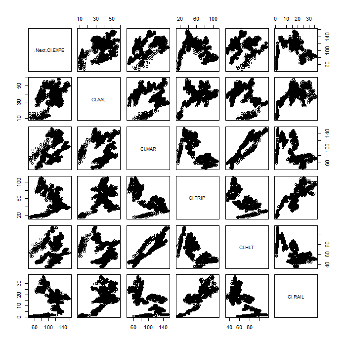
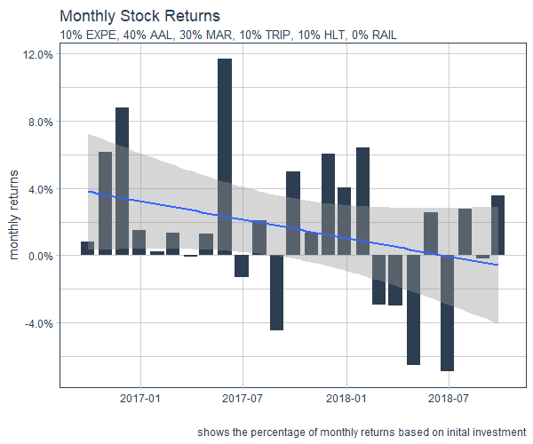
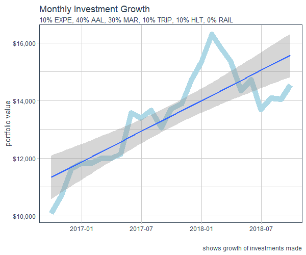

# Project 2

## Part 1

I collected data from the American Community Survey 5-Year Data API through the US Census Bureau. After binding the data from 2010-2014, I faceted the total population growth
and the annual growth rate into 9 quantiles. The plots above show the facets for each variable.

## Part 2

For the second part of Project 2, I retrieved data about the stocks of Expedia Group (EXPE), American Airlines (AAL), Marriott International (MAR), Tripadvisor (TRIP), Hilton (HLT), and Freightcar America Inc. (RAIL), all of which are related to the travel industry within the US. I used Expedia as the response variable and the remaining companies as predictors. 

Summary of Model

## Part 3

Using the same stocks from Part 2, I allocated a percentage of an initial investment of $10,000 into each of the 6 stocks. Based on the candlestick plots of each stock from Part 2 and various testing to optimize the growth of the investment, I found that the allocation shown below had one of the better returns of investment.

