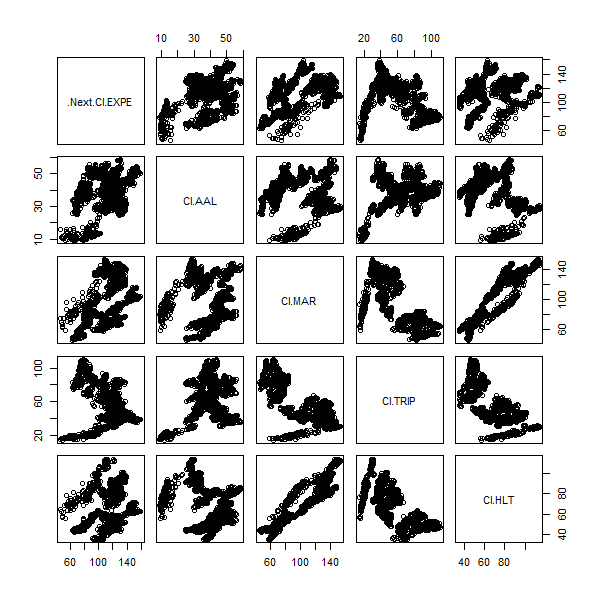

# Project 2

## Part 1

I collected data from the American Community Survey 5-Year Data API through the US Census Bureau. After binding the data from 2010-2014, I faceted the total population growth
and the annual growth rate into 9 quantiles. The plots above show the facets for each variable.

## Part 2

For the second part of Project 2, I retrieved data about the stocks of Expedia Group (EXPE), American Airlines (AAL), Marriott International (MAR), Tripadvisor (TRIP), Hilton (HLT), and Freightcar America Inc. (RAIL), all of which are related to the travel industry within the US. I used Expedia as the response variable and the remaining companies as predictors. 

.png)

.png)
