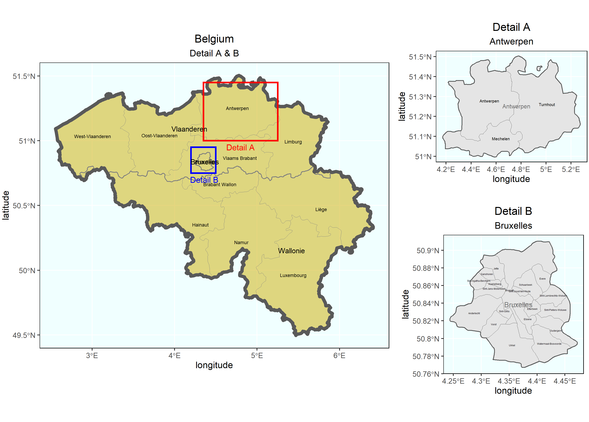

# Project 3

## Part 1

### Projecting, Plotting, and Labelling Administrative Subdivisions

I gathered data from GADM to plot the subdivisions of Belgium. Using the adm0, adm1, and adm2 shapefiles, I was able to plot the data. I used the simple features and ggplot
packages to plot the layers of data.

### Stretch Goal 1

I also plotted the subdivisions of Belgium using data from geoBoundaries. While the divisions of Belgium were very similar for both sources, geoBoundaries used different 
labels for certain regions or provinces. 

### Stretch Goal 2

Using data from adm1 and adm2, I was able to pipe and filter data from only the Vlaanderen region of Belgium. I then plotted the data, which showed the region in more depth,
including its provinces. 

### Stretch Goal 3

In the plot above, I showed the two most populous provinces of Belgium in more detail. Detail A shows Antwerpen and its 3 boroughs while Detail B shows Bruxelles and its 19 
municipalities. For Antwerpen, I used adm3 to show more detail while I used adm4 for Bruxelles because the capital city is not broken into smaller regions until the municipalities are defined. 
