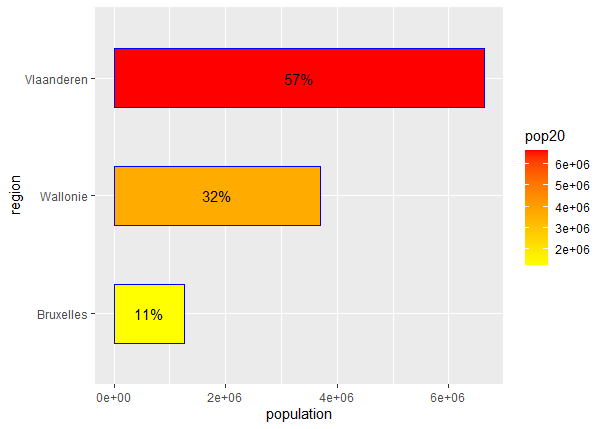
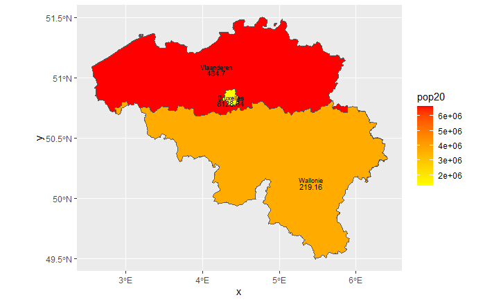
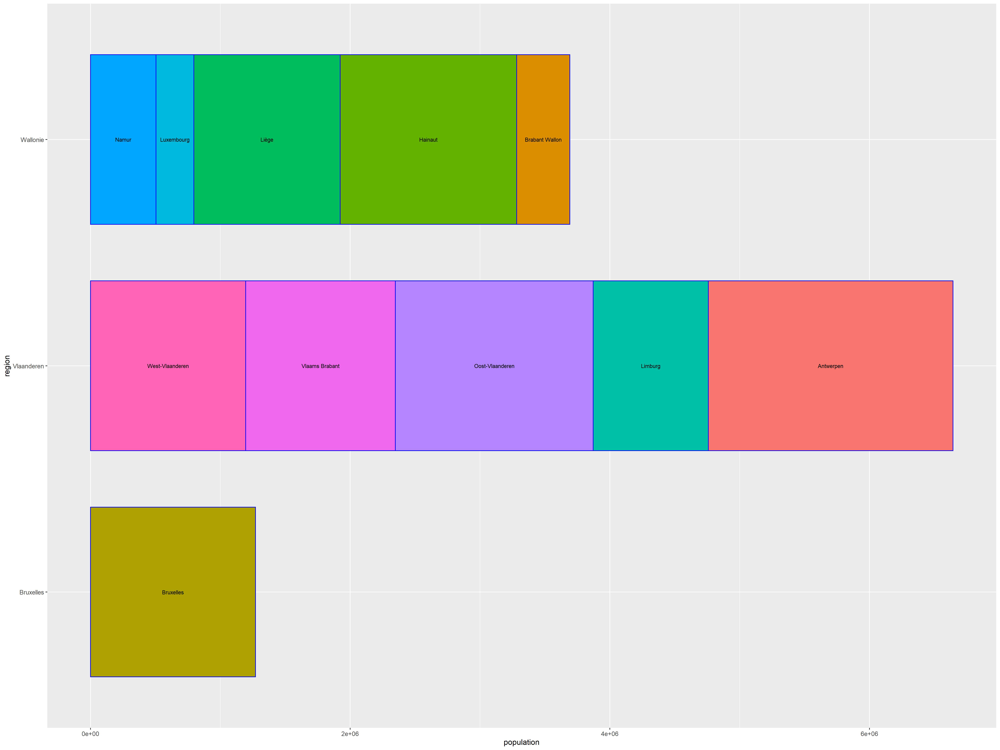

# Project 4

## Part 1

### Extracting Populations from a Raster and Aggregating to each Unit

Using data from WorldPop, I created a raster object and found the basic information about the object.

After adding the total populations of each region to the adm1 shapefile, I created a heatmap of the population totals for each region. Based on the plot shown, Vlaaderen has 
the greatest total population, followed by Wallonie and Bruxelles.

### Stretch Goal 1

Similar the previous plot, I added the total populations of each province to the adm2 shapefile. I then created a heatmap of the log of population totals for each region. Based 
on the plot shown above, more northern provinces have a greater population. 

### Stretch Goal 2

Using the data from plotting the heatmap of Belgium's provinces, I layered the regional boundaries and labels (acquired from adm1) to discern the location of individual 
provinces within larger regions. I also added a third color to the heatmap gradient. 

### Stretch Goal 3

Using data from the log of adm2 population totals, I created a three-dimensional plot of the gradient population map. I then rendered a rotating three-dimensional gif of the 
plot. 

## Part 2

### Creating a Geometric Bar Plot with Simple Feature object

The barplot above shows the total population of each region of Belgium and the distribution of Belgium's total population as a percent. The total populations are shown in decreasing order and are also indicated by the gradient colors.

Using a heatmap of Belgium's regional populations from Part 1, I added the densities of each region (in persons/km^2).

I combined the previous two plots to display the distribution of Belgium's population both numerically and graphically. The heatmap on the left indicates total population of that region as well as population density. The barplot has a coordinating gradient that also displays the percent of Belgium's total population.

### Stretch Goal 1

Using data from Belgium's adm2 shapefile, I produced a barplot which displayed the population totals of each region while also showing the distribution of population among the provinces of each region. 

