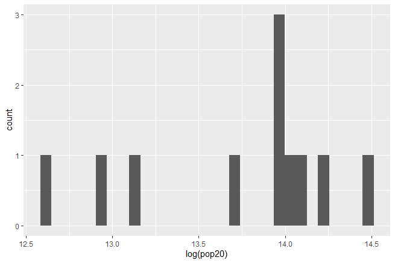
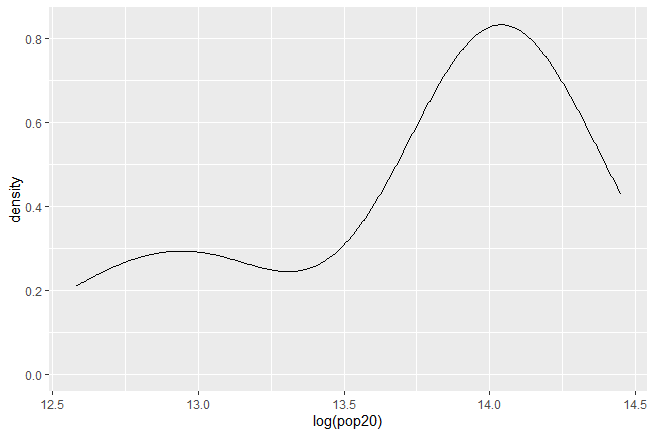
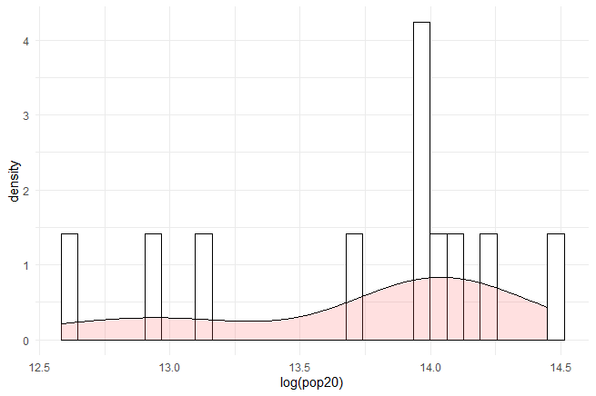
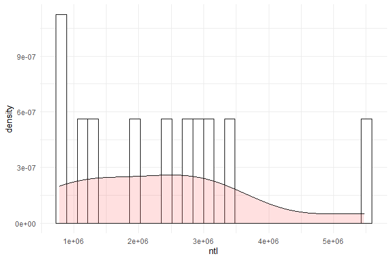

# Project 5

## Part 1

### Acquiring, Modifying, and Describing the Data

Using data from WorldPop, I layered the raster layers and extracted the land use and land cover data for adm2. I then plotted the log of the population of Belgium for 2020 in a histogram and a density plot. 

Similar to the two previous plots, I layered the plots which can give a more robust representation of the data for Belgium. The first plot shows the log of the population of Belgium's provinces for 2020 and the second shows the extent of NTL(Nighttime Lights) for each of Belgium's provinces.

